# ft_IRC
```bash
    ██████   █████              █████ ███████████     █████████ 
   ███░░███ ░░███              ░░███ ░░███░░░░░███   ███░░░░░███
  ░███ ░░░  ███████             ░███  ░███    ░███  ███     ░░░ 
 ███████   ░░░███░              ░███  ░██████████  ░███         
░░░███░      ░███               ░███  ░███░░░░░███ ░███         
  ░███       ░███ ███           ░███  ░███    ░███ ░░███     ███
  █████      ░░█████  █████████ █████ █████   █████ ░░█████████ 
 ░░░░░        ░░░░░  ░░░░░░░░░ ░░░░░ ░░░░░   ░░░░░   ░░░░░░░░░
```

This is the main repository for Internet Relay Chat project at School 42<br />

    


---
## IRC protocol

IRC is a text-based communication protocol over TCP/IP. It was first published in 1988 through RFC 1459, updated in 2000 by RFC 2810-2813. An IRC v3 was even proposed later on, which we didn't follow in this project.

Established as a a successor to the Bulletin Board Systems, it grew popular the 1990s, before giving way to proprietary messaging services such as ICQ or MSN.

Yet IRC community remains alive, with IRCNet, Libera Chat or OFTC being today's most popular IRC networks.

## Subjet

This project is about creating your own IRC server.
You are required to develop an IRC server using the C++ 98 standard.
Your executable will be run as follows: `./ircserv <port> <password>`
### Requirements
- The server must be capable of handling multiple clients simultaneously without hanging.
- Only 1 poll() (or equivalent) can be used for handling all these operations (read, write, but also listen, and so forth).
- Several IRC clients exist. You have to choose one of them as a reference. Your reference client will be used during the evaluation process.
- Communication between client and server has to be done via TCP/IP (v4 or v6).
### Features
- message forwarding
- operator status
- Registration and User related commands
  - `PASS` Authenticate a client
  - `NICK` Change client nickname
  - `USER` Register username and real name
- Messaging command
  - `PRIVMSG` send a message to a client or a channel
- Channel related commands (some of which might be reserved to channel operators):
  - `JOIN` Enter a channel
  - `KICK` Eject a client from the channel
  - `INVITE` Invite a client to a channel
  - `TOPIC` Change or view the channel topic
  - `MODE` Change the channel’s mode with following options
    - `k`: Set/remove the channel key (password)
    - `i`: Set/remove Invite-only channel
    - `l`: Set/remove the user limit to channel
    - `t`: Set/remove the restrictions of the TOPIC command to channel operators
  - `MODE` Also change user mode with 
    - `o`: Give/take channel operator privilege
### Bonus   
- Handle file transfer.
- Have a bot
### Extra features
We implemented extra commands not specifically asked in the subject
- PART
- QUIT
- PING
- WHO
- MOTD (message of the day, sent on successful registration)
---

## Collaboration workflow

- a main repository with individual forks
- issues to define main features or fixes
- each issue is worked upon on a dedicated branch
- a `main` branch that feature branches must synchronize with and where PR are submitted to
- we strived to follow basic commit message formatting

cf. [wiki](https://github.com/jmkko/ft_IRC/wiki/Workflow) for details

## Quality and continuous integration workflow

### Norm and format

- using `clang-format`
- based upon [LLVM coding rules](https://llvm.org/docs/CodingStandards.html))

cf. [wiki](https://github.com/jmkko/ft_IRC/wiki/Norm) for details

### Static analysis

- using `clang-tidy`

cf. [wiki](https://github.com/jmkko/ft_IRC/wiki/Static-Analysis) for details

### Testing

- a subproject `test` using c++20
- integration tests to prevent regression
- no unit tests (as they might be redundant with integration tests most of the time : projet is not that big)

cf. [wiki](https://github.com/jmkko/ft_IRC/wiki/Testing) for details

### Continuous integration

- using Github Actions pipelines : one for build and static checks, one for testing

## Architecture

### Documentation

cf [Doxygen generated documentation](https://jmkko.github.io/ft_IRC/html/index.html)

### UML Class diagram

```mermaid
---
title: Hazardous IRC Server
---
classDiagram
    note for Server "Channel operators commands\nfor channel\nKICK, INVITE,TOPIC,MODE(i:invite-only, t:TOPIC restriction,k: channel key; o:operator privilege, l:user limit)"
    class Server
    Server *-- TcpSocket
    Server *-- Client
    note for Server "can handling multiple client\ncan be non blocking\ncan have only one poll()\ncan have TCP/IP communication"
    Server *-- Channel
    Server *-- Config
    Server *-- LogManager
    Server : -TcpSocket _serverSocket
    Server : -vector~pollfd~ _pfds
    Server : -map~Socket,Client*~ _clients
    Server : -map~Socket,BotState~ _bots
	  Server : -map~string,Client*~ _clientsByNick
	  Server : -string _psswd
    Server : -string _name
    Server : -unsigned short _port
    Server : +map~string,Channel*~ channels
    Server: +start()
    Server: +stop()
    
    class Config{
        -string _name
        -string _passwd
        -int _port
        ...
        +get_...()
        +set_...()
    }
    Client *--Channel
    note for Client "messageQueue for incompleted message"
    class Client{
        -TcpSocket _socket
        -sockaddr_in _addr
        -string _addrStr
        -string _nickName
        -string _userName
        -string _realName
        -Clientstatus _status
        -string _sendBuffer
        -string _readBuffer
        -map~string, Channel*~ _joinedChannels
        +string messageQueue
        +string nickName
        +string userName
        +string realName
        +bool isRegistered
        +map~string~ joinedChannels
        +set...()
        +get...()
        ...()
    }
    
    note for TcpSocket "no copy possible"
    class TcpSocket{
        -SOCKET _sckt
        -TcpSocket(const TcpSocket&)
        -TcpSocket& operator=(const TcpSocket&)
        +getSocket() SOCKET
        +connect(const string ipadrress, unsigned short port)bool
        +getAddress(const sockaddr_in &addr) static string
		    +setNonBlockingSocket(void) int
		    +Send(const unsigned char *data, unsigned short len) int
		    +Receive(vector~unsigned char~ &buffer) int
    }
    
    class CmdFactory{
    }
    CmdFactory *-- ICommand
    ICommand *-- Server
    ICommand *-- Client
    ICommand *-- ReplyHandler
    class ICommand{
	    -virtual ~Icommand()
	    -virtual bool execute(Server& server, Client& client) = 0
		}
		ICommand <|-- Invite
		ICommand <|-- Join
		ICommand <|-- Kick
		ICommand <|-- Mode
		ICommand <|-- Motd
		ICommand <|-- Nick
		ICommand <|-- Part
		ICommand <|-- Pass
		ICommand <|-- Ping
		ICommand <|-- Privmsg
		ICommand <|-- Quit
		ICommand <|-- Topic
		ICommand <|-- User
		ICommand <|-- Who
		class Invite{
    +execute()
    -string _nickname
    -string _channelName
		}	
		class Join{
    +execute()
    -...()
    -map~string,string~ _chans
		}	
		class Kick{
    +execute()
    -...()
    -vector~string~ _channelsNames
    -vector~string~ _usersNames
    -string _msg
		}
		class Mode{
    +execute()
    -...()
    -string _channelName
    -queue~string~ _modeQueue
    -queue~string~ _paramsQueue
    -string _params
		}
		class Motd{
    +execute()
    -...()
    -string _params
		}
		class Nick{
    +execute()
    -string _nickname
		}
		class Part{
    +execute()
    -vector~string~ _chanNames
    -string _message
		}
		class Pass{
    +execute()
    -string _pass
		}
		class Ping{
    +execute()
    -string _token
		}
		Privmsg *-- Channel
		class Privmsg{
    +execute()
    -...()
    -vector~string~ _targets
    -string _message
    -string _params
    -string _msg
    -vector~Channel*~ _chans
    -vector~Client*~ _dests
		}
		class Quit{
    +execute()
    -string _quitMsg
		}
		class Topic{
    +execute()
    -...()
    -string _chan
    -string _topic
    -bool _clearTopic
		}
		class User{
		+execite()
		-string _username
		-string _mode
		-string _unused
		-string _realname
		}
		class Who{
    +execute()
    -...()
    -string _mask
    -string _op
		}
	  Channel *-- Client
	  class Channel{
    -string _name
    -string _topic
    -string _key
    -unsigned short _mode
	  -int _userLimit
	  -set~Client*~ _members
	  -set~Client*~ _invites
	  -set~Client*~ _operator
	  -set~Client*~ _banList
	  -static _isValidChannelName(string name) bool   
    +get...()
    +is...();
    +addMember(Client& client)
    +removeMember(Client& client)
    +makeOperator(Client& client)
    +broadcast(const string& message, Client* sender = NULL)
    ...()
		}
		
		class Logger {
    +enum LogLevel(DEBUG = 0 INFO = 1 WARNING = 2 ERROR = 3)
    -ofstream logFile
    -LogLevel currentLevel
    +Logger(const std::string& filename, LogLevel level = INFO);
    +~Logger()
    +log(LogLevel level, const std::string& message);
    +debug(const std::string& msg);
    +info(const std::string& msg);
    +warning(const std::string& msg);
    +error(const std::string& msg);
    -getCurrentTime() string
    -levelToString(LogLevel level) string
		}
		Parser *--Server
		Parser *--Client
		class Parser{
		-Server _server
		-Cleint _client
		-bool _isValidCommand
		}
		note for ReplyHandler "to be used by Command execute#execute::execu"
		class ReplyHandler{
		+sendReply(int clientInint clientIndex,Server) void
		+sendErrorNeedMoreParam()
		}
```



---

## Developed skills

This project is a capstone for the 42 common core curriculum, allowing us to collaborate as a team and apply all the skills we’ve acquired throughout the program.

| Skill/Tool               | Description                                                                 |
|--------------------------|-----------------------------------------------------------------------------|
|  | Object-oriented programming on a full-scale project                        |
|  | TCP, Sockets, `poll` for event-driven I/O                                   |
|  | Message syntax and server-client communication                             |
|  | Implemented `Singleton` and `Factory` patterns                              |
|  | Code quality and naming conventions                                         |
|  | Full GitHub workflow: Forks, Actions, Rules, Projects, Wiki, and Pages      |
|  | Automatic documentation from code comments                                  |
|  | Structured documentation with embedded diagrams using `Mermaid`            |

---

## Main networking functions

- socket creation and closure (`socket`)
- network byte order conversion (`htons`, `ntohs`, `htonl`, `ntohl`)
- connection management (`connect`, `bind`, `listen`, `accept`)
- data transmission (`send`, `recv`)
- event monitoring (`poll`)

cf. [wiki](https://github.com/jmkko/ft_IRC/wiki/Networking-functions) for details

---

## Sources

### RFC
[RFC-145912](https://www.rfc-editor.org/rfc/rfc1459)<br />
[RFC-2812](https://www.rfc-editor.org/rfc/rfc2812)<br />
### Networking functions
[Poll](https://devarea.com/linux-io-multiplexing-select-vs-poll-vs-epoll/)<br />
[Network programing](https://beej.us/guide/bgnet/html/)<br />
[Server TCP](https://bousk.developpez.com/cours/reseau-c++/TCP/01-premiers-pas/)<br />
### Other interesting resources
[Serveur IRC](https://www.cs.cmu.edu/~srini/15-441/S10/project1/pj1_description.pdf)<br />
[Projet IRC](http://chi.cs.uchicago.edu/chirc/index.html)<br />
[Design Pattern](https://refactoring.guru/fr/design-patterns/singleton)<br />
[Mermaid](https://mermaid.js.org/syntax/classDiagram.html)<br />
